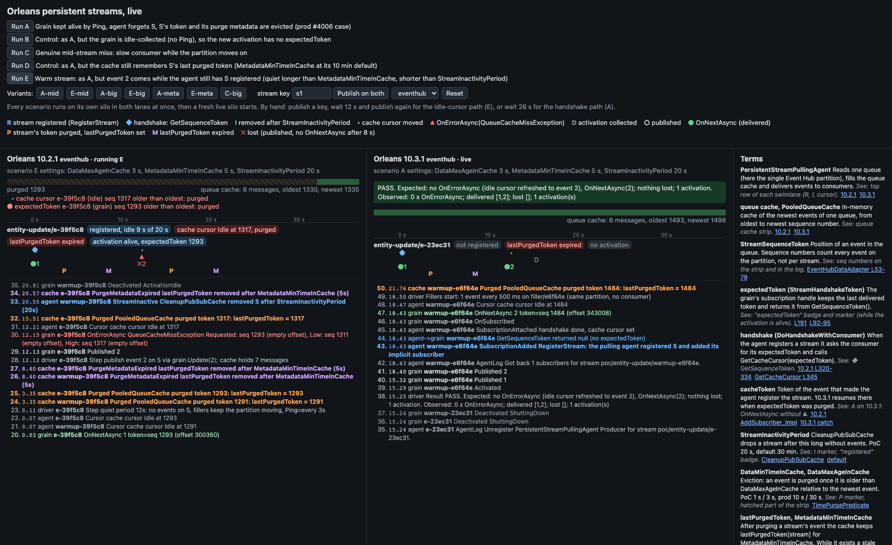

# Orleans #4006 PoC: stale `StreamSequenceToken` after a stream goes quiet

Minimal Orleans app that reproduces the `QueueCacheMissException` errors behind [Azure/ahm-planning#4006](https://github.com/Azure/ahm-planning/issues/4006) and shows how Orleans 10.3.1 changes them. The same code runs against Orleans **10.2.1** and **10.3.1**, on **memory streams** and on the **Azure Event Hubs emulator**.

Terms: a `StreamSequenceToken` is a stream position. For Event Hub it is an `EventHubSequenceToken` (offset, sequence number, event index), and sequence numbers count events per **partition**. After a delivery the subscription handle keeps the token as `expectedToken` (a `StreamHandshakeToken`) and returns it from `GetSequenceToken()` during a handshake. `cacheToken` is the token of the event that made the pulling agent register the stream again. S is the consumer grain's own stream.

## What it proves

- **Handshake path (the #4006 noise), scenario A.** The consumer grain stays active, the pulling agent forgets S, S's last token is evicted, then a new event arrives. On 10.2.1 the grain gets `OnErrorAsync(QueueCacheMissException)` and then `OnNextAsync(event 2)`. On 10.3.1 it only gets `OnNextAsync(event 2)`. Nothing is lost on either version.
- **Keep-alive matters, scenario B.** If the grain is idle-collected, the new activation returns `null` from `GetSequenceToken()` and no version reports an error.
- **Purge metadata matters, scenario D.** `PooledQueueCache` remembers the last purged token per stream for `MetadataMinTimeInCache` (default 10 min). While it does, a stale token resumes at the oldest cached message without throwing. Prod's 30 min `StreamInactivityPeriod` is longer than that, so the metadata was always gone by the time the handshake ran.
- **Idle-cursor path (`RunConsumerCursor`), scenario E. This is a real loss on 10.2.1.** S is still registered, but it was quiet for longer than `MetadataMinTimeInCache` and shorter than `StreamInactivityPeriod`. Its idle cursor still points at an evicted position. On 10.2.1 the next event throws `QueueCacheMissException` in `RunConsumerCursor`. The cursor then jumps to the newest message, so **event 2 is skipped**. On 10.3.1 with Event Hub, `EventHubAdapterReceiver.Cursor.Refresh` calls `PooledQueueCache.Refresh`, which moves the idle cursor to the new event: no error and no loss. Memory streams still lose the event on 10.3.1 because their cursor `Refresh` does nothing.
- **Genuine mid-stream miss, scenario C.** A slow consumer falls behind the cache. Both versions call `OnErrorAsync(QueueCacheMissException)` and skip the evicted events.
- **A bigger `DataMaxAgeInCache` would not have fixed #4006, variants A-mid, E-mid, A-big, E-big, A-meta, E-meta, C-big.** Doubling it (still shorter than the quiet period) gives the same errors and the same loss as A and E. Only a cache longer than the quiet period avoids them, at a proportional cost in cached messages. A longer `MetadataMinTimeInCache` avoids both paths without growing the cache. A bigger cache does help a genuinely slow consumer (C-big). See [Would a bigger cache have helped?](#would-a-bigger-cache-have-helped).

## How to run

Requires the .NET 10 SDK and Docker (only for the Event Hub transport).

```bash
open -a Docker                          # if the daemon is not running
./run-all.sh                            # 12 scenarios x {10.2.1, 10.3.1} x {memory, eventhub}, about 24 min
TRANSPORTS=memory ./run-all.sh          # no Docker needed
VERSIONS=10.2.1 TRANSPORTS=eventhub SCENARIOS=A,E ./run-all.sh
SCENARIOS=A-mid,E-mid,A-big,E-big,A-meta,E-meta,C-big ./run-all.sh   # cache-size variants only, about 14 min
docker compose down                     # stop the emulator and Azurite
```

Single run by hand:

```bash
dotnet build src/Poc -c Release -p:OrleansVersion=10.2.1
dotnet artifacts/10.2.1/bin/Release/net10.0/Poc.dll --transport eventhub --scenarios A,E --out results
```

Output: `results/<version>-<transport>.json` and `.md` (full callback timeline per scenario), `results/logs/<version>-<transport>-<scenario>.log` (silo log, pulling agent at Debug), `results/summary.md`. Each run prints the loaded `Orleans.Streaming` version and path, so you can check which build was used.

## Learn Orleans streams with the live UI

A web page runs the same scenarios on Orleans 10.2.1 and 10.3.1 side by side and shows grain callbacks, handshakes and queue cache changes as they happen.

```bash
cd live
docker compose up --build        # first build takes a few minutes
open http://localhost:8103
./smoke.sh                       # publish on both lanes, expect OnNextAsync on /api/events
docker compose down              # compose project orleans-poc-4006-ui
```

Compose publishes only ports 8102 (10.2.1) and 8103 (10.3.1). The Event Hubs emulator and Azurite stay on the compose network, so you can run the stack next to the root `docker-compose.yml`.



What to click:

- **Run A** (handshake path): both lanes restart on a scenario silo. After 26 s event 2 arrives. On 10.2.1 you see `R ◆ ▲ ●2`: the pulling agent registers S again, `GetSequenceToken` returns event 1's token, the grain gets `OnErrorAsync(QueueCacheMissException)` with `Requested` older than `Low`, then `OnNextAsync(2)`. On 10.3.1 you see `R ◆ ●2` without `▲`. Screenshot: [docs/live-ui-A.png](docs/live-ui-A.png).
- **Run E** (idle-cursor path): event 2 arrives after 12 s while S is still registered. Before it, the strip shows the cache cursor older than the oldest cached event and the badge `lastPurgedToken expired`. On 10.2.1 you get `▲` with `Requested: seq N (empty offset)`, then `✕2`: the agent never delivers event 2, and the cache purges it a few seconds later. On 10.3.1 `Cursor.Refresh` moves the idle cursor and the grain gets `OnNextAsync(2)`.
- **Run B, C, D** and the variants: same as the CLI (see [What it proves](#what-it-proves)). The result line under the lane header shows the coded expectation and PASS or FAIL.
- **Publish on both**: publishes on the live silo that runs between scenarios (scenario A timings, fillers, keep-alive Ping). Publish `s1`, wait 12 s and publish again for path E, or wait 26 s for path A.
- **Reset** with `memory` selected switches both lanes to memory streams. E then loses event 2 on 10.3.1 as well.

What each view shows:

| View | Orleans concept | Source |
|---|---|---|
| Queue cache strip: cached range, hatched purged part, cursor, `lastPurgedToken` and `expectedToken` markers | `PooledQueueCache` oldest and newest `StreamSequenceToken`, eviction by `DataMaxAgeInCache` | [TimePurgePredicate.cs L32-36](https://github.com/dotnet/orleans/blob/v10.3.1/src/Orleans.Streaming/Common/PooledCache/TimePurgePredicate.cs#L32-L36) |
| Badge `registered, idle x s of 20 s`, markers `R` and `I` | stream registration and `CleanupPubSubCache` after `StreamInactivityPeriod` | [v10.2.1 L642](https://github.com/dotnet/orleans/blob/v10.2.1/src/Orleans.Streaming/PersistentStreams/PersistentStreamPullingAgent.cs#L642), [L575-585](https://github.com/dotnet/orleans/blob/v10.2.1/src/Orleans.Streaming/PersistentStreams/PersistentStreamPullingAgent.cs#L575-L585) |
| Marker `◆` and log line `GetSequenceToken returned DeliveryToken(...)` | handshake, `expectedToken` | [v10.2.1 L320-334](https://github.com/dotnet/orleans/blob/v10.2.1/src/Orleans.Streaming/PersistentStreams/PersistentStreamPullingAgent.cs#L320-L334), [StreamSubscriptionHandleImpl.cs L191](https://github.com/dotnet/orleans/blob/v10.3.1/src/Orleans.Streaming/Internal/StreamSubscriptionHandleImpl.cs#L191) |
| Marker `▲` then `●` on 10.2.1, only `●` on 10.3.1 | `ErrorProtocol`, fallback to `cacheToken` | [v10.2.1 L354-379](https://github.com/dotnet/orleans/blob/v10.2.1/src/Orleans.Streaming/PersistentStreams/PersistentStreamPullingAgent.cs#L354-L379), [v10.3.1 L362-373](https://github.com/dotnet/orleans/blob/v10.3.1/src/Orleans.Streaming/PersistentStreams/PersistentStreamPullingAgent.cs#L362-L373) |
| Markers `P` and `M`, badge `lastPurgedToken` | purge metadata, `MetadataMinTimeInCache` | [PooledQueueCache.cs v10.2.1 L140-166](https://github.com/dotnet/orleans/blob/v10.2.1/src/Orleans.Streaming/Common/PooledCache/PooledQueueCache.cs#L140-L166), [L198-220](https://github.com/dotnet/orleans/blob/v10.2.1/src/Orleans.Streaming/Common/PooledCache/PooledQueueCache.cs#L198-L220) |
| Badge `cache cursor Idle at N, purged`, marker `▾`, `✕` lost | idle cursor in `RunConsumerCursor`, `Cursor.Refresh` | [EventHubAdapterReceiver.cs v10.2.1 L399-401](https://github.com/dotnet/orleans/blob/v10.2.1/src/Azure/Orleans.Streaming.EventHubs/Providers/Streams/EventHub/EventHubAdapterReceiver.cs#L399-L401), [v10.3.1 L443-446](https://github.com/dotnet/orleans/blob/v10.3.1/src/Azure/Orleans.Streaming.EventHubs/Providers/Streams/EventHub/EventHubAdapterReceiver.cs#L443-L446), [PersistentStreamPullingAgent.cs v10.2.1 L799-804](https://github.com/dotnet/orleans/blob/v10.2.1/src/Orleans.Streaming/PersistentStreams/PersistentStreamPullingAgent.cs#L799-L804) |
| Badge `activation alive` / `no activation`, marker `D` | activation collection, `CollectionAge` | [GrainCollectionOptions.cs L24](https://github.com/dotnet/orleans/blob/v10.3.1/src/Orleans.Runtime/Configuration/Options/GrainCollectionOptions.cs#L24) |

The Terms panel on the page has the same terms with more source links.

How it works:

- `live/compose.yml` builds `live/Dockerfile` twice (`ORLEANS_VERSION=10.2.1` and `10.3.1`). Each backend (`src/Live`) co-hosts the silo and a minimal API, serves the built React page (`live/web`) and reads its own Event Hub (`poc-hub-1021`, `poc-hub-1031`, 1 partition each), so the lanes do not share traffic.
- Scenarios call `Scenarios.Run` from `src/Poc` with the shared `Timeline`, so the UI runs the exact CLI scenarios and expectations.
- Event sources: `Timeline` (grain callbacks, `HandshakeProbe`, pulling-agent log lines), the Orleans `StreamingEvents` diagnostics (`SubscriptionAdded`, `SubscriptionAttached`, `StreamInactive`), and `src/Live/Inspector.cs`, which reads `PersistentStreamPullingAgent.pubSubCache`, the consumer cursors and `PooledQueueCache` (oldest, newest, `lastPurgedToken`) by reflection every 250 ms.
- API: `GET /api/events` (Server-Sent Events, replays everything since the last reset), `GET /api/state`, `POST /api/publish {"key":"s1"}`, `POST /api/scenarios/{id}/run`, `POST /api/reset?transport=eventhub|memory`.

Limits:

- The inspector reads Orleans internals that are the same in 10.2.1 and 10.3.1. Other versions may need new field names.
- The inspector samples state every 250 ms, so you cannot see the `Refresh` call. You see its effect: on 10.3.1 the cursor moves to event 2 and no `▲` follows.
- The two lanes start their silos independently, so their clocks differ by a few seconds. 10.2.1 finishes E later because the driver waits 30 s for the lost event.
- In C the driver publishes the burst on the stream directly, so lost events show only in the result line, not as `✕`.

## Setup

| Piece | PoC | Prod equivalent |
|---|---|---|
| Consumer | `ConsumerGrain`: `[ImplicitStreamSubscription]`, `IStreamSubscriptionObserver`, `OnSubscribed` calls `handleFactory.Create<T>().ResumeAsync(this)`, `OnErrorAsync` only records | `EntityConfigGrain.cs` L31, L63-78 |
| Producer | `grain.Update(v)` publishes on the grain's own stream | `EntityConfigGrain.HandleEntityUpdate` L150 |
| Keep-alive | driver calls `grain.Ping()` every 3 s | discovery `GetConfig()` every 5 min |
| Other traffic on the partition | 1 filler event every 500 ms on `filler/<id>` (no consumer), 1 partition | other entities hashed to the same partition |
| Stream provider | `AddMemoryStreams` or `AddEventHubStreams` (emulator + Azure Table checkpointer on Azurite), `StreamPubSubType.ImplicitOnly` | `Silo/Program.cs` L190-245 |
| `DataMinTimeInCache` / `DataMaxAgeInCache` | 1 s / 3 s (`-mid`: 6 s, `-big`: 40 s) | 10 s / 30 s |
| `MetadataMinTimeInCache` | 5 s (D: 10 min default, `-meta`: 40 s) | 10 min default |
| `StreamInactivityPeriod` (cleanup every 1/10) | 20 s | 30 min default |
| `CollectionAge` / `CollectionQuantum` | 10 s / 2 s | 15 min / 1 min defaults |
| Quiet period before event 2 | A, B, D and `A-*`: 26 s (longer than `StreamInactivityPeriod` + cleanup). E, `E-big`, `E-meta`: 12 s (longer than eviction + metadata, shorter than `StreamInactivityPeriod`). `E-mid`: 17 s (same rule with the 6 s cache) | 30+ min (A), 10-30 min (E) |
| Cache stats | `MeterListener` on `orleans-streams-queue-cache-length` / `-size` (`DefaultCacheMonitor`), `StatisticMonitorWriteInterval` 1 s | same instruments, 5 min default |

A silo-side `IIncomingGrainCallFilter` (`HandshakeProbe`) records what `GetSequenceToken()` returns during the handshake, and pulling-agent log lines about S (`Got back 1 subscribers for stream ...`) go into the timeline as evidence of (re)registration.

## Results

All 48 runs (12 scenarios x 2 versions x 2 transports) matched the expectations coded in `src/Poc/Scenarios.cs` (full table with settings, cache stats and expectations: [results/summary.md](results/summary.md)).

| Scenario | Transport | 10.2.1 OnErrorAsync | 10.2.1 delivered | 10.2.1 lost | 10.3.1 OnErrorAsync | 10.3.1 delivered | 10.3.1 lost |
|---|---|---|---|---:|---|---|---:|
| A handshake (prod case) | eventhub | 1 x QueueCacheMissException | 2/2 | 0 | 0 | 2/2 | 0 |
| A handshake (prod case) | memory | 1 x QueueCacheMissException | 2/2 | 0 | 0 | 2/2 | 0 |
| B no keep-alive | eventhub | 0 | 2/2 | 0 | 0 | 2/2 | 0 |
| B no keep-alive | memory | 0 | 2/2 | 0 | 0 | 2/2 | 0 |
| C slow consumer | eventhub | 2 x QueueCacheMissException | 1/21 | 20 | 1 x QueueCacheMissException | 2/21 | 19 |
| C slow consumer | memory | 2 x QueueCacheMissException | 1/21 | 20 | 2 x QueueCacheMissException | 1/21 | 20 |
| D purge metadata kept | eventhub | 0 | 2/2 | 0 | 0 | 2/2 | 0 |
| D purge metadata kept | memory | 0 | 2/2 | 0 | 0 | 2/2 | 0 |
| E idle cursor (`RunConsumerCursor`) | eventhub | 1 x QueueCacheMissException | 1/2 | 1 | 0 | 2/2 | 0 |
| E idle cursor (`RunConsumerCursor`) | memory | 1 x QueueCacheMissException | 1/2 | 1 | 1 x QueueCacheMissException | 1/2 | 1 |

"OnErrorAsync" is the count on S's grain, with exception type. "Delivered" and "Lost" are the published versions seen or missing in `OnNextAsync`.

### Cache-size variants

Each cell is OnErrorAsync / delivered / lost (QCME = `QueueCacheMissException`). Settings in seconds. "Max cached" is the peak `orleans-streams-queue-cache-length` on the single partition, 10.2.1 / 10.3.1. The partition carries about 2 events/s.

| Scenario | Transport | `DataMaxAgeInCache` | `MetadataMinTimeInCache` | Quiet | 10.2.1 | 10.3.1 | Max cached |
|---|---|---:|---:|---:|---|---|---|
| A (baseline) | eventhub | 3 | 5 | 26 | 1 x QCME / 2 of 2 / 0 | 0 / 2 of 2 / 0 | 9 / 9 |
| A (baseline) | memory | 3 | 5 | 26 | 1 x QCME / 2 of 2 / 0 | 0 / 2 of 2 / 0 | 9 / 9 |
| A-mid | eventhub | 6 | 5 | 26 | 1 x QCME / 2 of 2 / 0 | 0 / 2 of 2 / 0 | 15 / 15 |
| A-mid | memory | 6 | 5 | 26 | 1 x QCME / 2 of 2 / 0 | 0 / 2 of 2 / 0 | 15 / 15 |
| A-big | eventhub | 40 | 5 | 26 | 0 / 2 of 2 / 0 | 0 / 2 of 2 / 0 | 60 / 60 |
| A-big | memory | 40 | 5 | 26 | 0 / 2 of 2 / 0 | 0 / 2 of 2 / 0 | 62 / 61 |
| A-meta | eventhub | 3 | 40 | 26 | 0 / 2 of 2 / 0 | 0 / 2 of 2 / 0 | 9 / 9 |
| A-meta | memory | 3 | 40 | 26 | 0 / 2 of 2 / 0 | 0 / 2 of 2 / 0 | 9 / 9 |
| E (baseline) | eventhub | 3 | 5 | 12 | 1 x QCME / 1 of 2 / 1 | 0 / 2 of 2 / 0 | 9 / 9 |
| E (baseline) | memory | 3 | 5 | 12 | 1 x QCME / 1 of 2 / 1 | 1 x QCME / 1 of 2 / 1 | 9 / 9 |
| E-mid | eventhub | 6 | 5 | 17 | 1 x QCME / 1 of 2 / 1 | 0 / 2 of 2 / 0 | 15 / 15 |
| E-mid | memory | 6 | 5 | 17 | 1 x QCME / 1 of 2 / 1 | 1 x QCME / 1 of 2 / 1 | 14 / 15 |
| E-big | eventhub | 40 | 5 | 12 | 0 / 2 of 2 / 0 | 0 / 2 of 2 / 0 | 32 / 32 |
| E-big | memory | 40 | 5 | 12 | 0 / 2 of 2 / 0 | 0 / 2 of 2 / 0 | 33 / 33 |
| E-meta | eventhub | 3 | 40 | 12 | 0 / 2 of 2 / 0 | 0 / 2 of 2 / 0 | 9 / 9 |
| E-meta | memory | 3 | 40 | 12 | 0 / 2 of 2 / 0 | 0 / 2 of 2 / 0 | 9 / 9 |
| C (baseline) | eventhub | 3 | 5 | | 2 x QCME / 1 of 21 / 20 | 1 x QCME / 2 of 21 / 19 | 28 / 28 |
| C (baseline) | memory | 3 | 5 | | 2 x QCME / 1 of 21 / 20 | 2 x QCME / 1 of 21 / 20 | 27 / 28 |
| C-big | eventhub | 40 | 5 | | 0 / 21 of 21 / 0 | 0 / 21 of 21 / 0 | 47 / 47 |
| C-big | memory | 40 | 5 | | 0 / 21 of 21 / 0 | 0 / 21 of 21 / 0 | 48 / 48 |

`orleans-streams-queue-cache-size` reported 1,048,576 bytes in every run: the pool allocates 1 MB blocks and PoC volumes never need a second block. At prod volume the cost is cached messages x serialized message size, rounded up to 1 MB blocks.

## Key log excerpts

From `results/10.2.1-eventhub.md` and `results/10.3.1-eventhub.md` (t in seconds from scenario start; event 1 was delivered at t = 0.03).

A on 10.2.1: re-registration, stale `expectedToken`, error, then delivery.

```text
26.157 agent         Got back 1 subscribers for stream poc/entity-update/a-a0660f.
26.160 agent->grain  GetSequenceToken returned DeliveryToken(EventHubSequenceToken(EventHubOffset: 31984, SequenceNumber: 187, EventIndex: 0))
26.165 grain         OnErrorAsync Orleans.Streams.QueueCacheMissException: Item not found in cache.  Requested: EventHubSequenceToken(EventHubOffset: 31984, SequenceNumber: 187, EventIndex: 0), Low: EventHubSequenceToken(EventHubOffset: , SequenceNumber: 232, EventIndex: 0), High: EventHubSequenceToken(EventHubOffset: , SequenceNumber: 238, EventIndex: 0)
26.166 grain         OnNextAsync 2 token=EventHubSequenceToken(EventHubOffset: 40968, SequenceNumber: 238, EventIndex: 0)
```

A on 10.3.1: same handshake, no error.

```text
26.143 agent         Got back 1 subscribers for stream poc/entity-update/a-5c73d8.
26.146 agent->grain  GetSequenceToken returned DeliveryToken(EventHubSequenceToken(EventHubOffset: 92112, SequenceNumber: 527, EventIndex: 0))
26.148 grain         OnNextAsync 2 token=EventHubSequenceToken(EventHubOffset: 101096, SequenceNumber: 578, EventIndex: 0)
```

E on 10.2.1: no re-registration and no `GetSequenceToken`. `Requested` is event 1's own position (SequenceNumber 436) with an empty offset. Event 2 never reaches `OnNextAsync`.

```text
 0.039 grain         OnNextAsync 1 token=EventHubSequenceToken(EventHubOffset: 76072, SequenceNumber: 436, EventIndex: 0)
12.132 grain         Published 2
12.154 grain         OnErrorAsync Orleans.Streams.QueueCacheMissException: Item not found in cache.  Requested: EventHubSequenceToken(EventHubOffset: , SequenceNumber: 436, EventIndex: 0), Low: EventHubSequenceToken(EventHubOffset: , SequenceNumber: 454, EventIndex: 0), High: EventHubSequenceToken(EventHubOffset: , SequenceNumber: 460, EventIndex: 0)
```

E on 10.3.1: the idle cursor is refreshed to event 2.

```text
 0.024 grain         OnNextAsync 1 token=EventHubSequenceToken(EventHubOffset: 133040, SequenceNumber: 758, EventIndex: 0)
12.132 grain         Published 2
12.154 grain         OnNextAsync 2 token=EventHubSequenceToken(EventHubOffset: 137272, SequenceNumber: 782, EventIndex: 0)
```

A-mid vs A-big on 10.2.1 Event Hub: same handshake, same stale `expectedToken`. With a 6 s cache the token is gone; with a 40 s cache it is still one of the 53 cached messages.

```text
A-mid  26.114 driver        publish event 2 on S via grain.Update(2); cache holds 13 messages
A-mid  26.151 agent->grain  GetSequenceToken returned DeliveryToken(EventHubSequenceToken(EventHubOffset: 60576, SequenceNumber: 348, EventIndex: 0))
A-mid  26.152 grain         OnErrorAsync Orleans.Streams.QueueCacheMissException: Item not found in cache.  Requested: EventHubSequenceToken(EventHubOffset: 60576, SequenceNumber: 348, EventIndex: 0), Low: EventHubSequenceToken(EventHubOffset: , SequenceNumber: 388, EventIndex: 0), ...
A-mid  26.152 grain         OnNextAsync 2 token=EventHubSequenceToken(EventHubOffset: 69560, SequenceNumber: 399, EventIndex: 0)
A-big  26.113 driver        publish event 2 on S via grain.Update(2); cache holds 53 messages
A-big  26.146 agent->grain  GetSequenceToken returned DeliveryToken(EventHubSequenceToken(EventHubOffset: 89320, SequenceNumber: 511, EventIndex: 0))
A-big  26.146 grain         OnNextAsync 2 token=EventHubSequenceToken(EventHubOffset: 98304, SequenceNumber: 562, EventIndex: 0)
```

## Hypothesis check

| Step | Verdict | Evidence |
|---|---|---|
| 1. After a delivery the handle keeps `expectedToken` (rewindable stream) | Confirmed | A: `GetSequenceToken` returns `DeliveryToken(<event 1 token>)` 26 s later. [StreamSubscriptionHandleImpl.cs v10.3.1 L191](https://github.com/dotnet/orleans/blob/v10.3.1/src/Orleans.Streaming/Internal/StreamSubscriptionHandleImpl.cs#L191), [L92-95](https://github.com/dotnet/orleans/blob/v10.3.1/src/Orleans.Streaming/Internal/StreamSubscriptionHandleImpl.cs#L92-L95) |
| 2. The grain stays active, so `expectedToken` survives | Confirmed | A: 1 activation, pinged. B: without Ping the grain is collected (`Deactivated ActivationIdle`), the new activation returns `null` and no error is reported on any version |
| 3a. The agent forgets S after `StreamInactivityPeriod` | Confirmed | A: `Got back 1 subscribers for stream .../a-...` logged again at event 2. [v10.2.1 L491](https://github.com/dotnet/orleans/blob/v10.2.1/src/Orleans.Streaming/PersistentStreams/PersistentStreamPullingAgent.cs#L491), [L575-585](https://github.com/dotnet/orleans/blob/v10.2.1/src/Orleans.Streaming/PersistentStreams/PersistentStreamPullingAgent.cs#L575-L585); [v10.3.1 L529](https://github.com/dotnet/orleans/blob/v10.3.1/src/Orleans.Streaming/PersistentStreams/PersistentStreamPullingAgent.cs#L529), [L620-645](https://github.com/dotnet/orleans/blob/v10.3.1/src/Orleans.Streaming/PersistentStreams/PersistentStreamPullingAgent.cs#L620-L645) |
| 3b. S's token is evicted relative to the newest event on the partition | Confirmed | `Requested` is older than `Low` in every miss. [ChronologicalEvictionStrategy.cs v10.2.1 L91-98](https://github.com/dotnet/orleans/blob/v10.2.1/src/Orleans.Streaming/Common/PooledCache/ChronologicalEvictionStrategy.cs#L91-L98), [TimePurgePredicate.cs v10.3.1 L32-36](https://github.com/dotnet/orleans/blob/v10.3.1/src/Orleans.Streaming/Common/PooledCache/TimePurgePredicate.cs#L32-L36) |
| 3c. (not in the original hypothesis) S's purge metadata must be gone too | Added | D: with `MetadataMinTimeInCache` = 10 min, 10.2.1 does not throw. `SetCursor` resumes at the oldest message when the requested token is not older than S's last purged token: [PooledQueueCache.cs v10.2.1 L198-220](https://github.com/dotnet/orleans/blob/v10.2.1/src/Orleans.Streaming/Common/PooledCache/PooledQueueCache.cs#L198-L220), [v10.3.1 L233-254](https://github.com/dotnet/orleans/blob/v10.3.1/src/Orleans.Streaming/Common/PooledCache/PooledQueueCache.cs#L233-L254). Metadata expiry: [v10.2.1 L140-166](https://github.com/dotnet/orleans/blob/v10.2.1/src/Orleans.Streaming/Common/PooledCache/PooledQueueCache.cs#L140-L166), [v10.3.1 L174-200](https://github.com/dotnet/orleans/blob/v10.3.1/src/Orleans.Streaming/Common/PooledCache/PooledQueueCache.cs#L174-L200). Default `MetadataMinTimeInCache` = 2 x 5 min: [RecoverableStreamOptions.cs L36-41](https://github.com/dotnet/orleans/blob/v10.3.1/src/Orleans.Streaming/Common/RecoverableStreamOptions.cs#L36-L41) |
| 4a. Re-registration handshake: `GetCacheCursor(expectedToken)` throws | Confirmed | A, both versions reach it. [v10.2.1 L642](https://github.com/dotnet/orleans/blob/v10.2.1/src/Orleans.Streaming/PersistentStreams/PersistentStreamPullingAgent.cs#L642) `RegisterStream`, [L345](https://github.com/dotnet/orleans/blob/v10.2.1/src/Orleans.Streaming/PersistentStreams/PersistentStreamPullingAgent.cs#L345); [v10.3.1 L701](https://github.com/dotnet/orleans/blob/v10.3.1/src/Orleans.Streaming/PersistentStreams/PersistentStreamPullingAgent.cs#L701), [L365](https://github.com/dotnet/orleans/blob/v10.3.1/src/Orleans.Streaming/PersistentStreams/PersistentStreamPullingAgent.cs#L365) |
| 4b. 10.2.1: `OnErrorAsync`, then resume at `cacheToken` | Confirmed | A 10.2.1, both transports. [v10.2.1 L363](https://github.com/dotnet/orleans/blob/v10.2.1/src/Orleans.Streaming/PersistentStreams/PersistentStreamPullingAgent.cs#L363) `ErrorProtocol`, [L368-379](https://github.com/dotnet/orleans/blob/v10.2.1/src/Orleans.Streaming/PersistentStreams/PersistentStreamPullingAgent.cs#L368-L379) fallback |
| 4c. 10.3.1: silent resume at `cacheToken` | Confirmed | A 10.3.1, both transports. [v10.3.1 L367-372](https://github.com/dotnet/orleans/blob/v10.3.1/src/Orleans.Streaming/PersistentStreams/PersistentStreamPullingAgent.cs#L367-L372) |

### Contradiction: "no loss" does not hold for every 10.2.1 miss

Scenario E is a second code path that throws the same exception and **does lose the event** on 10.2.1:

1. After delivering an event, the consumer's cursor goes idle at the newest partition position it scanned ([PooledQueueCache.cs v10.2.1 L310-311](https://github.com/dotnet/orleans/blob/v10.2.1/src/Orleans.Streaming/Common/PooledCache/PooledQueueCache.cs#L310-L311), [v10.3.1 L344-345](https://github.com/dotnet/orleans/blob/v10.3.1/src/Orleans.Streaming/Common/PooledCache/PooledQueueCache.cs#L344-L345)). The stream stays registered because it is quiet for less than `StreamInactivityPeriod`.
2. When the next event arrives, `StartInactiveCursors` calls `consumerData.Cursor?.Refresh(startToken)` ([v10.2.1 L755](https://github.com/dotnet/orleans/blob/v10.2.1/src/Orleans.Streaming/PersistentStreams/PersistentStreamPullingAgent.cs#L755), [v10.3.1 L813](https://github.com/dotnet/orleans/blob/v10.3.1/src/Orleans.Streaming/PersistentStreams/PersistentStreamPullingAgent.cs#L813)).
   - 10.2.1 Event Hub: `EventHubAdapterReceiver.Cursor.Refresh` is empty ([EventHubAdapterReceiver.cs v10.2.1 L399-401](https://github.com/dotnet/orleans/blob/v10.2.1/src/Azure/Orleans.Streaming.EventHubs/Providers/Streams/EventHub/EventHubAdapterReceiver.cs#L399-L401)).
   - 10.3.1 Event Hub: it calls `cache.Refresh` ([EventHubAdapterReceiver.cs v10.3.1 L443-446](https://github.com/dotnet/orleans/blob/v10.3.1/src/Azure/Orleans.Streaming.EventHubs/Providers/Streams/EventHub/EventHubAdapterReceiver.cs#L443-L446), [EventHubQueueCache.cs v10.3.1 L141-144](https://github.com/dotnet/orleans/blob/v10.3.1/src/Azure/Orleans.Streaming.EventHubs/Providers/Streams/EventHub/EventHubQueueCache.cs#L141-L144)). That lands in the new `PooledQueueCache.Refresh`, which moves an idle cursor to the new event ([PooledQueueCache.cs v10.3.1 L123-155](https://github.com/dotnet/orleans/blob/v10.3.1/src/Orleans.Streaming/Common/PooledCache/PooledQueueCache.cs#L123-L155), not present in 10.2.1).
   - Memory streams: `MemoryPooledCache.Cursor.Refresh` is empty in both versions ([v10.2.1 L133-135](https://github.com/dotnet/orleans/blob/v10.2.1/src/Orleans.Streaming/MemoryStreams/MemoryPooledCache.cs#L133-L135), [v10.3.1 L135-137](https://github.com/dotnet/orleans/blob/v10.3.1/src/Orleans.Streaming/MemoryStreams/MemoryPooledCache.cs#L135-L137)).
3. Without the refresh, `RunConsumerCursor` calls `MoveNext`, and `TryGetNextMessage` re-seeks the idle cursor at its evicted position ([PooledQueueCache.cs v10.2.1 L282-289](https://github.com/dotnet/orleans/blob/v10.2.1/src/Orleans.Streaming/Common/PooledCache/PooledQueueCache.cs#L282-L289), [v10.3.1 L316-323](https://github.com/dotnet/orleans/blob/v10.3.1/src/Orleans.Streaming/Common/PooledCache/PooledQueueCache.cs#L316-L323)). The purge metadata has expired, so `SetCursor` throws ([v10.2.1 L216](https://github.com/dotnet/orleans/blob/v10.2.1/src/Orleans.Streaming/Common/PooledCache/PooledQueueCache.cs#L216), [v10.3.1 L250](https://github.com/dotnet/orleans/blob/v10.3.1/src/Orleans.Streaming/Common/PooledCache/PooledQueueCache.cs#L250)).
4. `RunConsumerCursor` catches it and recreates the cursor with `GetCacheCursor(streamId, null)`, which is the newest message, idle ([v10.2.1 L799-804](https://github.com/dotnet/orleans/blob/v10.2.1/src/Orleans.Streaming/PersistentStreams/PersistentStreamPullingAgent.cs#L799-L804), [v10.3.1 L862-867](https://github.com/dotnet/orleans/blob/v10.3.1/src/Orleans.Streaming/PersistentStreams/PersistentStreamPullingAgent.cs#L862-L867)). It then calls `ErrorProtocol(..., isDeliveryError: true, ...)`, which delivers `OnErrorAsync` ([v10.2.1 L867](https://github.com/dotnet/orleans/blob/v10.2.1/src/Orleans.Streaming/PersistentStreams/PersistentStreamPullingAgent.cs#L867), [v10.3.1 L953](https://github.com/dotnet/orleans/blob/v10.3.1/src/Orleans.Streaming/PersistentStreams/PersistentStreamPullingAgent.cs#L953)). The new event sits at or before that position, so it is never delivered.

The grain is not asked for its token on this path, so keep-alive does not matter. Prod window with the defaults: the next event on the entity arrives roughly 10.5 to 30 min after the previous one. The edges are fuzzy because metadata expiry is checked every 2 min (`MetadataMinTimeInCache / 5`) and inactivity cleanup runs every 3 min.

How to tell the two paths apart in logs: the handshake path's `Requested` token is the delivered batch token, which carries an `EventHubOffset`. The idle-cursor path's `Requested` token comes from the cache and has an empty offset (`EventHubOffset: ,`), see `EventHubDataAdapter.cs` L53 (cache token, `""` offset) vs L79 (batch token, real offset), same lines in [v10.2.1](https://github.com/dotnet/orleans/blob/v10.2.1/src/Azure/Orleans.Streaming.EventHubs/Providers/Streams/EventHub/EventHubDataAdapter.cs#L53-L79) and [v10.3.1](https://github.com/dotnet/orleans/blob/v10.3.1/src/Azure/Orleans.Streaming.EventHubs/Providers/Streams/EventHub/EventHubDataAdapter.cs#L53-L79). In `../data/dgrep` there are 65 unique messages with an offset and 1 without. The one without is entity `4371d781-...` at 2026-09-07T00:31:53.83Z (`Requested: SequenceNumber 2126, Low 2128, High 2129`). 2126 is where its 00:11:49 handshake had resumed, 20 min earlier. The parent analysis found no processing log after it, but that query only reached `Searching`.

### Other observations

- Scenario C: events 2..20 are evicted while event 1 is still being processed (6 s), so all versions report the miss and skip them. The miss moves the cursor to the newest position, and that position is evicted too before event 21 arrives 4 s later. On memory (both versions) and 10.2.1 Event Hub, event 21 then causes a second miss and is skipped, which is path E again. On 10.3.1 Event Hub the refresh moves the cursor to event 21, so it is delivered.
- The emulator reproduces the prod error text, for example `Requested: EventHubSequenceToken(EventHubOffset: 31984, SequenceNumber: 187, ...), Low: EventHubSequenceToken(EventHubOffset: , SequenceNumber: 232, ...)` (scenario A, 10.2.1).
- The Event Hubs emulator image runs natively on arm64 (no `platform` override needed).

## Would a bigger cache have helped?

Not at any practical size. The variants confirm the two conditions from the source above:

- Handshake noise (path A) needs the grain alive and a quiet period longer than both `StreamInactivityPeriod` and `DataMaxAgeInCache + MetadataMinTimeInCache` (the metadata entry is dropped between 1x and 1.2x `MetadataMinTimeInCache` after the purge, [PooledQueueCache.cs v10.2.1 L97-101](https://github.com/dotnet/orleans/blob/v10.2.1/src/Orleans.Streaming/Common/PooledCache/PooledQueueCache.cs#L97-L101)).
- The idle-cursor loss (path E) happens when `DataMaxAgeInCache + MetadataMinTimeInCache` < quiet < `StreamInactivityPeriod` (+ cleanup every `StreamInactivityPeriod / 10`).

Mapped to prod (`DataMaxAgeInCache` 30 s, `MetadataMinTimeInCache` 10 min, `StreamInactivityPeriod` 30 min, `GetConfig()` every 5 min keeps grains alive indefinitely):

| Prod setting | Handshake noise (A) | Idle-cursor loss window (E, 10.2.1 Event Hub) | Cached messages per partition | PoC evidence |
|---|---|---|---|---|
| As deployed: `DataMaxAgeInCache` 30 s | every live entity quiet for more than ~30 min | quiet ~10.5-12.5 min to ~30-33 min | rate x 30 s | A, E |
| `DataMaxAgeInCache` 2-5 min | unchanged | ~12-17 min to ~30-33 min, only slightly shorter | 4-10x | A-mid, E-mid: same errors, same loss |
| `DataMaxAgeInCache` about 23 min or more (with the 10 min metadata that covers `StreamInactivityPeriod` + cleanup) | still for entities quiet for more than ~33-35 min | closed | about 46x | derived from the rule: E-big (token still cached) and E-meta (metadata still present) cover the two halves |
| `DataMaxAgeInCache` longer than the longest time an entity stays unchanged (hours to days) | gone | closed | hundreds to thousands x | A-big, E-big |
| `MetadataMinTimeInCache` about 33 min or more, `DataMaxAgeInCache` 30 s | only for entities quiet for more than `MetadataMinTimeInCache` | closed | unchanged, plus one `lastPurgedToken` entry per stream (not per message) | E-meta, A-meta, D |
| Orleans 10.3.1 (current prod), no config change | not reported: resume at `cacheToken` | closed on Event Hub: `Cursor.Refresh` | unchanged | A, A-mid, E, E-mid on 10.3.1 eventhub |

- A moderate increase (A-mid, E-mid) changes nothing that matters. The token is still evicted long before the next event, and the E window only moves by the added minutes.
- A cache long enough to hold the token (A-big, E-big) does avoid both paths, but the cached messages grow linearly with `DataMaxAgeInCache` (measured peak: 9 at 3 s, 15 at 6 s, 60 at 40 s after a 29 s run, still rising). For the noise it must be longer than any quiet period, and that has no upper bound because the grains never idle out.
- `MetadataMinTimeInCache` is the cheap 10.2.1 knob. It keeps one `(StreamId, token)` entry per stream ([PooledQueueCache.cs v10.2.1 L38](https://github.com/dotnet/orleans/blob/v10.2.1/src/Orleans.Streaming/Common/PooledCache/PooledQueueCache.cs#L38), [L154-166](https://github.com/dotnet/orleans/blob/v10.2.1/src/Orleans.Streaming/Common/PooledCache/PooledQueueCache.cs#L154-L166)), so E-meta and A-meta avoid both paths while the cache still holds 9 messages. It also fixes path E on memory streams in 10.3.1, which Orleans itself does not.
- A bigger cache does help genuine lag: C-big delivers 21 of 21 on both versions. The prod analysis found no lag (average grain call 133 ms, no 429s), so that is not what #4006 was.
- The real fix is Orleans 10.3.1: on Event Hub it removes the handshake noise and the idle-cursor loss without any cache change.

## Files

| Path | What |
|---|---|
| `src/Poc/ConsumerGrain.cs` | consumer grain (mirrors `EntityConfigGrain`), `HandshakeProbe` call filter |
| `src/Poc/Scenarios.cs` | scenario table (A-E and cache-size variants), expectations, evaluation |
| `src/Poc/CacheStats.cs` | samples pooled cache message count and size from the Orleans cache monitor instruments |
| `src/Poc/SiloHost.cs` | silo config per transport, scaled timings |
| `src/Poc/Timeline.cs`, `TimelineLoggerProvider.cs` | callback log the driver asserts on, silo log capture |
| `src/Poc/Report.cs`, `Program.cs` | JSON/markdown output, CLI |
| `Directory.Build.props`, `Directory.Packages.props` | `-p:OrleansVersion=...` switch, per-version output under `artifacts/<version>/` |
| `docker-compose.yml`, `emulator/Config.json` | Event Hubs emulator (1 partition, consumer group `orleans`) + Azurite |
| `run-all.sh` | full matrix and `results/summary.md` |
| `src/Live/` | live UI backend: minimal API, SSE feed, silo per lane, `Inspector.cs` |
| `live/web/` | live UI page (React, Vite) |
| `live/compose.yml`, `live/Dockerfile`, `live/emulator.json`, `live/smoke.sh` | live UI stack and smoke test |
| `docs/live-ui-*.png` | live UI screenshots |
| `results/` | output of the last `./run-all.sh` |
