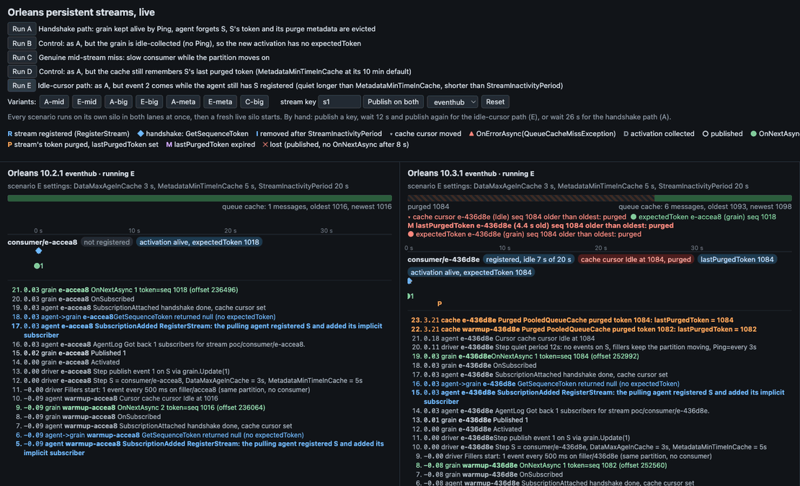
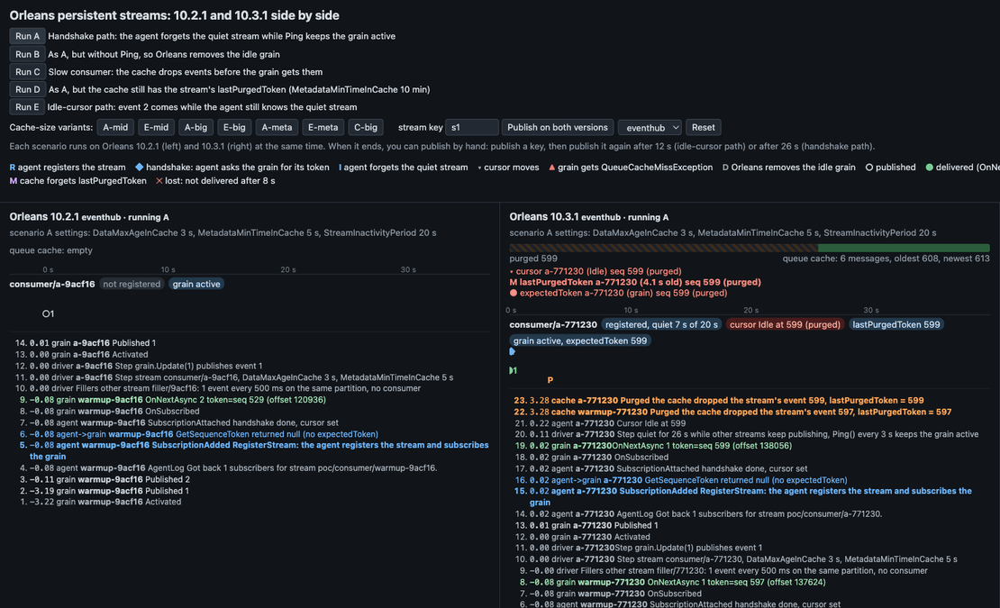

```mermaid
%%{init: {"flowchart": {"wrappingWidth": 420}}}%%
flowchart LR
    update[/"An update comes in"/] --> grain["ConsumerGrain<br/>stays active while it gets calls<br/>compares with its state,<br/>publishes only on change"]
    grain -- "publish on its own stream<br/>stream id = grain key" --> eh[("Event Hub, e.g. 32 partitions<br/>stream id hashed to one partition<br/>durable log")]
    eh -- "read new messages" --> agent
    subgraph silo["Silo"]
        manager["PersistentStreamPullingManager<br/>one per silo per stream provider"] -- "starts one agent<br/>per owned partition" --> agent["PersistentStreamPullingAgent<br/>one per partition (queue)"]
        agent -- "ReadFromQueue<br/>every 100 ms" --> cache[("Queue cache, one per partition<br/>all streams of the partition mixed<br/>purged when at least DataMinTimeInCache 10 s in cache<br/>and more than DataMaxAgeInCache 30 s<br/>older than the partition's newest message")]
        cache --- cursor["Cursor per consumer<br/>holds its last token<br/>kept until StreamInactivityPeriod 30 min<br/>without events"]
        cache --- purged["lastPurgedToken per stream<br/>kept MetadataMinTimeInCache 10 min"]
    end
    agent -- "OnNextAsync" --> grain2["ConsumerGrain, same activation<br/>keeps expectedToken<br/>(last delivered token)"]

    purged -.-> green["Quiet less than ~10.5 min<br/>lastPurgedToken proves nothing was lost<br/>resume at the oldest cached message"]
    cursor -.-> red["Quiet ~10.5 to 30 min<br/>cursor idle on a purged token, no lastPurgedToken<br/>QueueCacheMissException<br/>cursor reset to the newest message<br/>event skipped (10.2.1)"]
    grain2 -.-> yellow["Quiet more than 30 min<br/>agent forgot the stream<br/>handshake asks the grain for expectedToken<br/>miss reported to OnErrorAsync<br/>event still delivered from cacheToken (10.2.1)"]
    red -.-> fixes
    yellow -.-> fixes
    fixes["Fixes<br/>10.2.2 and 10.3.0+, #10266:<br/>Cursor.Refresh moves the idle cursor<br/>to the new event's token<br/>10.3.0+, #10574:<br/>handshake resumes at cacheToken, no OnErrorAsync<br/>main only, #9711 #9714 #11149:<br/>after a miss, resume at the stream's oldest message<br/>still in the local queue cache"]

    classDef ok fill:#1b4332,stroke:#3fb950,color:#e6edf3
    classDef loss fill:#5c1a1a,stroke:#f85149,color:#e6edf3
    classDef warn fill:#4a3b00,stroke:#d29922,color:#e6edf3
    classDef fix fill:#5a2d00,stroke:#f0883e,color:#e6edf3
    class green ok
    class red loss
    class yellow warn
    class fixes fix
    style silo fill:none,stroke:#8b949e
```

# Orleans persistent streams lab: when `QueueCacheMissException` is harmless and when it loses events (Orleans 10.2.1 vs 10.3.1)

A small [Orleans streaming](https://learn.microsoft.com/dotnet/orleans/streaming/) app with one consumer grain that has an implicit subscription on its own stream. It runs the same scenarios on Orleans **10.2.1** and **10.3.1**, on **memory streams** and on the **Azure Event Hubs emulator**, from a [live web UI](#see-it-live) that shows both versions side by side, or from a CLI (`run-all.sh`).

Two Orleans code paths throw [`QueueCacheMissException`](https://learn.microsoft.com/dotnet/api/orleans.streams.queuecachemissexception) after a stream goes quiet. The handshake path reports the error and loses nothing, while the idle-cursor path skips an event on 10.2.1. Orleans 10.3.x removes the handshake error on both transports and the idle-cursor loss on Event Hub.

## See it live



Left lane Orleans 10.2.1, right lane 10.3.1, each reading its own Event Hub. A consumer grain gets event 1, and its stream stays quiet for 12 s while other traffic pushes event 1 out of the queue cache. Then event 2 arrives. 10.2.1 reports `QueueCacheMissException` (`▲`) and never delivers event 2 (`✕2`). 10.3.1 delivers it (`●2`). The recording runs at 4x.

You need only Docker. Compose builds both backends and runs the [Event Hubs emulator](https://learn.microsoft.com/azure/event-hubs/overview-emulator) and [Azurite](https://learn.microsoft.com/azure/storage/common/storage-use-azurite).

```bash
cd live
docker compose up --build -d     # first build takes a few minutes
open http://localhost:8103       # the page reads both backends: 8102 (10.2.1) and 8103 (10.3.1)
./smoke.sh                       # publishes on both lanes, expects OnNextAsync on /api/events
docker compose down
```

Each **Run** button runs one scenario on both lanes. [What happens when a stream goes quiet](#what-happens-when-a-stream-goes-quiet) defines the scenarios, and the [walkthrough](#live-ui-walkthrough) explains every marker.

## How Orleans persistent streams work (in 5 minutes)

The diagram follows one update from a grain to Event Hub and back. It uses a cache tuned for low memory (`DataMinTimeInCache` 10 s, `DataMaxAgeInCache` 30 s) and Orleans defaults for everything else. Image version: [docs/how-streams-work.png](docs/how-streams-work.png).



### One read cycle

Each silo runs one `PersistentStreamPullingManager` per stream provider. The manager starts one `PersistentStreamPullingAgent` for each partition (queue) the silo owns ([pulling agents](https://learn.microsoft.com/dotnet/orleans/implementation/streams-implementation/#pulling-agents)). Every [`GetQueueMsgsTimerPeriod`](https://learn.microsoft.com/dotnet/api/orleans.configuration.streampullingagentoptions.getqueuemsgstimerperiod) (100 ms) the agent calls `ReadFromQueue` until the partition has no new messages ([v10.2.1 L439-458](https://github.com/dotnet/orleans/blob/v10.2.1/src/Orleans.Streaming/PersistentStreams/PersistentStreamPullingAgent.cs#L439-L458), [L482-573](https://github.com/dotnet/orleans/blob/v10.2.1/src/Orleans.Streaming/PersistentStreams/PersistentStreamPullingAgent.cs#L482-L573)):

1. **Clean up.** Every `StreamInactivityPeriod / 10`, `CleanupPubSubCache` drops streams that had no event for `StreamInactivityPeriod`.
2. **Purge.** `TryPurgeFromCache` evicts old messages. For each purged message the cache records the stream's `lastPurgedToken`.
3. **Read.** `GetQueueMessagesAsync` reads new messages from the partition and `AddToCache` stores them. For Event Hub, `EventHubAdapterReceiver` is both the `IQueueAdapterReceiver` and the [`IQueueCache`](https://learn.microsoft.com/dotnet/api/orleans.streams.iqueuecache). It wraps `EventHubQueueCache`, which wraps one [`PooledQueueCache`](https://learn.microsoft.com/dotnet/api/orleans.providers.streams.common.pooledqueuecache) per partition.
4. **Wake or register.** For each stream in the batch, `startToken` is that stream's first new message ([L556-569](https://github.com/dotnet/orleans/blob/v10.2.1/src/Orleans.Streaming/PersistentStreams/PersistentStreamPullingAgent.cs#L556-L569)).
   - Known stream: `RefreshActivity`, then `StartInactiveCursors` calls `Cursor.Refresh(startToken)` and wakes idle consumers.
   - Unknown stream: `RegisterStream` finds the subscribers (with an [implicit subscription](https://learn.microsoft.com/dotnet/orleans/streaming/streams-programming-apis#explicit-and-implicit-subscriptions), the grain whose key is the stream id) and runs the handshake. It asks the grain for its `expectedToken` (`GetSequenceToken()`) and opens a cursor there, or at `cacheToken`, the message that triggered the registration.
5. **Deliver.** `RunConsumerCursor` walks the cursor through the cache, skips other streams' messages and calls `DeliverBatch`, which ends in the grain's `OnNextAsync`. On a [rewindable stream](https://learn.microsoft.com/dotnet/orleans/streaming/streams-programming-apis#rewindable-streams) the grain's subscription handle keeps the delivered token as `expectedToken`. Once the cursor reaches the newest message, it goes `Idle`.

Only a new message for the stream wakes an idle cursor. No timer runs per cursor.

### What Orleans keeps, where, and for how long

| Where | What | How long (example config) | Setting |
|---|---|---|---|
| Event Hub partition | every event, in order, with [offset and sequence number](https://learn.microsoft.com/azure/event-hubs/event-hubs-features#event-data-structure) | the hub's [retention](https://learn.microsoft.com/azure/event-hubs/event-hubs-features#event-retention) | Event Hub |
| Checkpoint (Azure Table) | last processed offset per partition, read when an agent starts | until overwritten | checkpointer `PersistInterval` |
| Queue cache, per partition | the newest messages of all streams on the partition | `DataMaxAgeInCache` (30 s) [behind the newest message](https://github.com/dotnet/orleans/blob/v10.3.1/src/Orleans.Streaming/Common/PooledCache/TimePurgePredicate.cs#L32-L36), at least `DataMinTimeInCache` (10 s) | [`StreamCacheEvictionOptions`](https://learn.microsoft.com/dotnet/api/orleans.configuration.streamcacheevictionoptions) |
| `lastPurgedToken`, per stream | token of the stream's last purged message | `MetadataMinTimeInCache` (10 min) | [`StreamCacheEvictionOptions`](https://learn.microsoft.com/dotnet/api/orleans.configuration.streamcacheevictionoptions) |
| Agent pub-sub cache, per stream | the stream's consumers, one cursor each | until `StreamInactivityPeriod` (30 min) without events | [`StreamPullingAgentOptions`](https://learn.microsoft.com/dotnet/api/orleans.configuration.streampullingagentoptions) |
| `expectedToken`, in the grain | token of the last delivered event | while the activation lives, `CollectionAge` (15 min) after its last call | [`GrainCollectionOptions`](https://learn.microsoft.com/dotnet/api/orleans.configuration.graincollectionoptions) |

### Why the cache evicts

The [queue cache](https://learn.microsoft.com/dotnet/orleans/implementation/streams-implementation/#queue-cache) lives in silo memory and holds every stream of the partition, so it has to drop old messages. Its clock is the partition's newest message: on a busy partition, other streams push a quiet stream's last event out after about 30 s. The quiet stream keeps only its cursor and, for 10 min, its `lastPurgedToken`.

## What happens when a stream goes quiet

S is the consumer grain's own stream. The grain gets event 1, S stays quiet, then event 2 arrives. The quiet time picks the path.

The lab runs this as scenarios with short timings: `DataMaxAgeInCache` 3 s, `MetadataMinTimeInCache` 5 s, `StreamInactivityPeriod` 20 s, `CollectionAge` 10 s. A filler stream on the same partition publishes every 500 ms, so the cache keeps purging while S is quiet.

| Scenario | Setup | What it shows |
|---|---|---|
| A | event 1, 26 s quiet, `Ping()` every 3 s keeps the activation alive, event 2 | handshake path |
| B | as A, no `Ping()` | Orleans collects the activation, the new one returns `null` from `GetSequenceToken()`, no error |
| C | 20-event burst, event 1 takes 6 s | slow consumer: the cache purges events 2..20 before delivery, both versions report the miss and skip them |
| D | as A, `MetadataMinTimeInCache` 10 min | `lastPurgedToken` still present, the stale token resumes at the oldest message |
| E | as A, 12 s quiet | idle-cursor path |
| A-mid, E-mid | `DataMaxAgeInCache` 6 s (E-mid: 17 s quiet) | a bigger cache that is still shorter than the quiet period changes nothing |
| A-big, E-big | `DataMaxAgeInCache` 40 s | the cache still holds S's token, no miss |
| A-meta, E-meta | `MetadataMinTimeInCache` 40 s | the cache still has S's `lastPurgedToken`, no miss |
| C-big | as C, `DataMaxAgeInCache` 40 s | the cache outlasts the lag, nothing lost |

The next table uses the example config from the diagram. The edges shift by up to 2 min, because the cache expires `lastPurgedToken` entries every `MetadataMinTimeInCache / 5`, and by up to 3 min, because cleanup runs every `StreamInactivityPeriod / 10`. The PoC column uses the lab timings.

| Quiet before event 2 | PoC | What Orleans does | 10.2.1 | 10.3.1, Event Hub | Scenarios | Live UI |
|---|---|---|---|---|---|---|
| less than ~10.5 min | less than ~8 s | if the cache already purged the cursor's token, `lastPurgedToken` proves S lost nothing, and the cursor resumes at the oldest cached message | delivered | delivered | E-meta; D and A-meta on the handshake path | badge `lastPurgedToken N` |
| ~10.5 to 30 min | ~8 to 20 s | the cursor idles on a purged token and `lastPurgedToken` expired: `QueueCacheMissException`, cursor reset to the newest message | `OnErrorAsync`, event 2 lost | `Refresh` moves the cursor, delivered | E, E-mid | `M`, then `▲ ✕2` (10.3.1: `●2`) |
| more than 30 min, activation alive | more than ~22 s | the agent forgot S, and the handshake with `expectedToken` misses | `OnErrorAsync`, event 2 delivered from `cacheToken` | delivered, no error | A, A-mid | `I`, then `R ◆ ▲ ●2` (10.3.1: no `▲`) |
| more than 30 min, activation collected | more than ~22 s | the new activation has no `expectedToken`, so the cursor starts at `cacheToken` | delivered | delivered | B | `D`, then `R ◆ ●2` |
| any, slow consumer | | the cache purges events before the cursor reaches them | skipped | skipped | C (C-big: long enough cache) | result line |

### Idle-cursor path (scenario E): the failing check on 10.2.1

1. After event 1 the cursor goes idle. Its token is the partition's newest position when it caught up ([PooledQueueCache.cs v10.2.1 L307-311](https://github.com/dotnet/orleans/blob/v10.2.1/src/Orleans.Streaming/Common/PooledCache/PooledQueueCache.cs#L307-L311)), not S's own last event. In the E run both are event 1, because event 1 was the newest message at that moment.
2. About `DataMaxAgeInCache` later the cache purges event 1 and the cursor's position. `MetadataMinTimeInCache` after that, it forgets `lastPurgedToken[S]`.
3. Event 2 arrives. `StartInactiveCursors` calls `Cursor.Refresh(startToken)` ([agent v10.2.1 L755](https://github.com/dotnet/orleans/blob/v10.2.1/src/Orleans.Streaming/PersistentStreams/PersistentStreamPullingAgent.cs#L755)). On 10.2.1, `EventHubAdapterReceiver.Cursor.Refresh` is empty ([L399-401](https://github.com/dotnet/orleans/blob/v10.2.1/src/Azure/Orleans.Streaming.EventHubs/Providers/Streams/EventHub/EventHubAdapterReceiver.cs#L399-L401)), so the cursor keeps its old token. `MemoryPooledCache.Cursor.Refresh` is empty as well ([v10.2.1 L133-135](https://github.com/dotnet/orleans/blob/v10.2.1/src/Orleans.Streaming/MemoryStreams/MemoryPooledCache.cs#L133-L135), [v10.3.1 L135-137](https://github.com/dotnet/orleans/blob/v10.3.1/src/Orleans.Streaming/MemoryStreams/MemoryPooledCache.cs#L135-L137)).
4. `RunConsumerCursor` asks for the next message. `TryGetNextMessage` finds the cursor not `Set` and calls `SetCursor(cursor, cursor.SequenceToken)` ([L282-284](https://github.com/dotnet/orleans/blob/v10.2.1/src/Orleans.Streaming/Common/PooledCache/PooledQueueCache.cs#L282-L284)).
5. `SetCursor` compares the token with the cache ([L199-219](https://github.com/dotnet/orleans/blob/v10.2.1/src/Orleans.Streaming/Common/PooledCache/PooledQueueCache.cs#L199-L219)). A token older than the oldest cached message is normal after a few minutes and not an error by itself:
   - `lastPurgedToken[S]` exists and the token is at or after it: S lost nothing, and the cursor resumes at the oldest cached message ([L205-211](https://github.com/dotnet/orleans/blob/v10.2.1/src/Orleans.Streaming/Common/PooledCache/PooledQueueCache.cs#L205-L211)).
   - the entry expired: `SetCursor` throws `QueueCacheMissException` ([L216](https://github.com/dotnet/orleans/blob/v10.2.1/src/Orleans.Streaming/Common/PooledCache/PooledQueueCache.cs#L216)).
6. `RunConsumerCursor` catches the exception, resets the cursor with `GetCacheCursor(streamId, null)`, which points at the newest message ([agent v10.2.1 L799-804](https://github.com/dotnet/orleans/blob/v10.2.1/src/Orleans.Streaming/PersistentStreams/PersistentStreamPullingAgent.cs#L799-L804)), and `ErrorProtocol` delivers `OnErrorAsync` ([L867](https://github.com/dotnet/orleans/blob/v10.2.1/src/Orleans.Streaming/PersistentStreams/PersistentStreamPullingAgent.cs#L867)). Event 2 sits at or before that position, so the agent skips it.

10.2.1, from `results/10.2.1-eventhub.md` (t in seconds from scenario start). `Requested` is event 1's position with an empty offset, and event 2 never reaches `OnNextAsync`:

```text
 0.031 grain         OnNextAsync 1 token=EventHubSequenceToken(EventHubOffset: 44104, SequenceNumber: 256, EventIndex: 0)
12.124 grain         Published 2
12.145 grain         OnErrorAsync Orleans.Streams.QueueCacheMissException: Item not found in cache.  Requested: EventHubSequenceToken(EventHubOffset: , SequenceNumber: 256, EventIndex: 0), Low: EventHubSequenceToken(EventHubOffset: , SequenceNumber: 274, EventIndex: 0), High: EventHubSequenceToken(EventHubOffset: , SequenceNumber: 280, EventIndex: 0)
```

10.3.1: the refresh moves the idle cursor to event 2:

```text
 0.022 grain         OnNextAsync 1 token=EventHubSequenceToken(EventHubOffset: 172480, SequenceNumber: 983, EventIndex: 0)
12.122 grain         Published 2
12.143 grain         OnNextAsync 2 token=EventHubSequenceToken(EventHubOffset: 176704, SequenceNumber: 1007, EventIndex: 0)
```

Cursor tokens come from `EventHubDataAdapter.GetSequenceToken(ref CachedMessage)`, which returns `new EventHubSequenceTokenV2("", sequenceNumber, 0)` with an empty offset ([L51-54](https://github.com/dotnet/orleans/blob/v10.2.1/src/Azure/Orleans.Streaming.EventHubs/Providers/Streams/EventHub/EventHubDataAdapter.cs#L51-L54)). Delivered tokens carry the offset ([L79](https://github.com/dotnet/orleans/blob/v10.2.1/src/Azure/Orleans.Streaming.EventHubs/Providers/Streams/EventHub/EventHubDataAdapter.cs#L79)). So an empty `EventHubOffset` in `Requested` marks the idle-cursor path. The handshake path requests `expectedToken`, a delivered token with an offset.

### Handshake path (scenario A): error reported, event delivered

1. After event 1, the grain's subscription handle keeps its token as `expectedToken` ([StreamSubscriptionHandleImpl.cs L191](https://github.com/dotnet/orleans/blob/v10.3.1/src/Orleans.Streaming/Internal/StreamSubscriptionHandleImpl.cs#L191), [L92-95](https://github.com/dotnet/orleans/blob/v10.3.1/src/Orleans.Streaming/Internal/StreamSubscriptionHandleImpl.cs#L92-L95)).
2. A periodic read (`Ping()` every 3 s) keeps the activation alive, so `expectedToken` survives. Without it (scenario B), Orleans [collects the activation](https://learn.microsoft.com/dotnet/orleans/host/configuration-guide/activation-collection#how-activation-collection-works) after [`CollectionAge`](https://learn.microsoft.com/dotnet/api/orleans.configuration.graincollectionoptions.collectionage), and the new activation returns `null` from `GetSequenceToken()`.
3. After `StreamInactivityPeriod` without events, `CleanupPubSubCache` drops S and its cursor ([v10.2.1 L575-585](https://github.com/dotnet/orleans/blob/v10.2.1/src/Orleans.Streaming/PersistentStreams/PersistentStreamPullingAgent.cs#L575-L585), [v10.3.1 L620-645](https://github.com/dotnet/orleans/blob/v10.3.1/src/Orleans.Streaming/PersistentStreams/PersistentStreamPullingAgent.cs#L620-L645)). By then the cache has purged event 1 and forgotten `lastPurgedToken[S]`. If the entry still exists (scenario D), `SetCursor` resumes at the oldest message.
4. Event 2 makes the agent register S again (`RegisterStream`, [v10.2.1 L642](https://github.com/dotnet/orleans/blob/v10.2.1/src/Orleans.Streaming/PersistentStreams/PersistentStreamPullingAgent.cs#L642), [v10.3.1 L701](https://github.com/dotnet/orleans/blob/v10.3.1/src/Orleans.Streaming/PersistentStreams/PersistentStreamPullingAgent.cs#L701)) and log `Got back 1 subscribers for stream ...` ([v10.2.1 L491](https://github.com/dotnet/orleans/blob/v10.2.1/src/Orleans.Streaming/PersistentStreams/PersistentStreamPullingAgent.cs#L491)). The handshake calls `GetCacheCursor(expectedToken)` ([v10.2.1 L345](https://github.com/dotnet/orleans/blob/v10.2.1/src/Orleans.Streaming/PersistentStreams/PersistentStreamPullingAgent.cs#L345)), and `SetCursor` throws.
5. 10.2.1 calls `ErrorProtocol`, which delivers `OnErrorAsync`, then opens the cursor at `cacheToken` ([L363](https://github.com/dotnet/orleans/blob/v10.2.1/src/Orleans.Streaming/PersistentStreams/PersistentStreamPullingAgent.cs#L363), [L368-379](https://github.com/dotnet/orleans/blob/v10.2.1/src/Orleans.Streaming/PersistentStreams/PersistentStreamPullingAgent.cs#L368-L379)). The grain still gets event 2.

10.2.1:

```text
26.151 agent         Got back 1 subscribers for stream poc/consumer/a-5b937d.
26.152 agent->grain  GetSequenceToken returned DeliveryToken(EventHubSequenceToken(EventHubOffset: 344, SequenceNumber: 2, EventIndex: 0))
26.154 grain         OnErrorAsync Orleans.Streams.QueueCacheMissException: Item not found in cache.  Requested: EventHubSequenceToken(EventHubOffset: 344, SequenceNumber: 2, EventIndex: 0), Low: EventHubSequenceToken(EventHubOffset: , SequenceNumber: 47, EventIndex: 0), High: EventHubSequenceToken(EventHubOffset: , SequenceNumber: 53, EventIndex: 0)
26.155 grain         OnNextAsync 2 token=EventHubSequenceToken(EventHubOffset: 8912, SequenceNumber: 53, EventIndex: 0)
```

10.3.1, same handshake, no error:

```text
26.157 agent         Got back 1 subscribers for stream poc/consumer/a-fb9ff9.
26.160 agent->grain  GetSequenceToken returned DeliveryToken(EventHubSequenceToken(EventHubOffset: 131952, SequenceNumber: 753, EventIndex: 0))
26.163 grain         OnNextAsync 2 token=EventHubSequenceToken(EventHubOffset: 140928, SequenceNumber: 804, EventIndex: 0)
```

### Fixes

- **Idle cursor, 10.2.2 and 10.3.0+** ([#10266](https://github.com/dotnet/orleans/pull/10266)): `EventHubAdapterReceiver.Cursor.Refresh` calls `PooledQueueCache.Refresh` ([EventHubAdapterReceiver.cs v10.3.1 L443-446](https://github.com/dotnet/orleans/blob/v10.3.1/src/Azure/Orleans.Streaming.EventHubs/Providers/Streams/EventHub/EventHubAdapterReceiver.cs#L443-L446), [EventHubQueueCache.cs L141-144](https://github.com/dotnet/orleans/blob/v10.3.1/src/Azure/Orleans.Streaming.EventHubs/Providers/Streams/EventHub/EventHubQueueCache.cs#L141-L144), [PooledQueueCache.cs L128-155](https://github.com/dotnet/orleans/blob/v10.3.1/src/Orleans.Streaming/Common/PooledCache/PooledQueueCache.cs#L128-L155)). `Refresh` acts only on an `Idle` or `Unset` cursor with a non-null token and only moves it forward. It sets the cursor `Unset` and calls `SetCursor(startToken)`, so the cursor points at event 2. That is safe: an idle cursor has delivered everything before its position, and any earlier message of S would have woken it.
- **Handshake, 10.3.0+** ([#10574](https://github.com/dotnet/orleans/pull/10574), [release notes](https://github.com/dotnet/orleans/releases/tag/v10.3.0)): `catch (QueueCacheMissException) when (cacheToken is not null)` opens the cursor at the triggering message without `OnErrorAsync` ([v10.3.1 L367-372](https://github.com/dotnet/orleans/blob/v10.3.1/src/Orleans.Streaming/PersistentStreams/PersistentStreamPullingAgent.cs#L367-L372)).
- **Recovery, main only, not in 10.3.1** ([#9711](https://github.com/dotnet/orleans/pull/9711), [#9714](https://github.com/dotnet/orleans/pull/9714), [#11149](https://github.com/dotnet/orleans/pull/11149)): after a cache miss during delivery, the agent resumes at `StreamSubscriptionStartPosition.EarliestAvailable`. That is the oldest message of the stream still in the local queue cache, or the next one if there is none ([`GetCacheMissRecoveryCursor`](https://github.com/dotnet/orleans/blob/8bc9fd244427351ad24ccc039a9e7642a42c1cc4/src/Orleans.Streaming/PersistentStreams/PersistentStreamPullingAgent.cs#L767-L779), [`SetCursorAtEarliestAvailable`](https://github.com/dotnet/orleans/blob/8bc9fd244427351ad24ccc039a9e7642a42c1cc4/src/Orleans.Streaming/Common/PooledCache/PooledQueueCache.cs#L393-L409)). It does not read Event Hub again, so purged messages stay lost.
- **Memory streams:** `MemoryPooledCache.Cursor.Refresh` is still empty in 10.3.1, so E loses event 2 there. On main it calls `cache.Refresh` ([L184-187](https://github.com/dotnet/orleans/blob/8bc9fd244427351ad24ccc039a9e7642a42c1cc4/src/Orleans.Streaming/MemoryStreams/MemoryPooledCache.cs#L184-L187)).

## Live UI walkthrough

The page runs the scenarios on 10.2.1 and 10.3.1 at once and shows grain callbacks, handshakes and queue cache changes as they happen. The recording shows Run A at 4x: after 26 s of quiet both lanes register S again and run the handshake. 10.2.1 shows `▲` before `●2`, 10.3.1 only `●2`.



What to click:

- **Run A** (handshake path): both lanes restart on a scenario silo, and event 2 arrives after 26 s. The markers per version are in the [quiet table](#what-happens-when-a-stream-goes-quiet). In the `▲` log line, `Requested` is older than `Low`.
- **Run E** (idle-cursor path): event 2 arrives after 12 s while the agent still has S registered. Before it arrives, the strip shows the cache cursor older than the oldest cached event and the badge `lastPurgedToken expired`. On 10.2.1 the `▲` log line shows `Requested: seq N (empty offset)`, and the cache later purges the undelivered event 2.
- **Run B, C, D** and the variants: as in the [scenario table](#what-happens-when-a-stream-goes-quiet). The result line under the lane header shows the coded expectation and PASS or FAIL.
- **Publish on both** publishes on the live silo that runs between scenarios (scenario A timings, fillers, `Ping()` for published keys). Publish `s1`, wait 12 s and publish again for path E, or wait 26 s for path A.
- **Reset** with `memory` selected switches both lanes to memory streams. E then loses event 2 on 10.3.1 as well.

| View | Orleans concept | Source |
|---|---|---|
| Queue cache strip: cached range, hatched purged part, cursor, `lastPurgedToken` and `expectedToken` markers | `PooledQueueCache` oldest and newest `StreamSequenceToken`, eviction by `DataMaxAgeInCache` | [TimePurgePredicate.cs L32-36](https://github.com/dotnet/orleans/blob/v10.3.1/src/Orleans.Streaming/Common/PooledCache/TimePurgePredicate.cs#L32-L36) |
| Badge `registered, idle x s of 20 s`, markers `R` and `I` | stream registration and `CleanupPubSubCache` after `StreamInactivityPeriod` | [v10.2.1 L642](https://github.com/dotnet/orleans/blob/v10.2.1/src/Orleans.Streaming/PersistentStreams/PersistentStreamPullingAgent.cs#L642), [L575-585](https://github.com/dotnet/orleans/blob/v10.2.1/src/Orleans.Streaming/PersistentStreams/PersistentStreamPullingAgent.cs#L575-L585) |
| Marker `◆` and log line `GetSequenceToken returned DeliveryToken(...)` | handshake, `expectedToken` | [v10.2.1 L320-334](https://github.com/dotnet/orleans/blob/v10.2.1/src/Orleans.Streaming/PersistentStreams/PersistentStreamPullingAgent.cs#L320-L334), [StreamSubscriptionHandleImpl.cs L191](https://github.com/dotnet/orleans/blob/v10.3.1/src/Orleans.Streaming/Internal/StreamSubscriptionHandleImpl.cs#L191) |
| Marker `▲` then `●` on 10.2.1, only `●` on 10.3.1 | `ErrorProtocol`, fallback to `cacheToken` | [v10.2.1 L354-379](https://github.com/dotnet/orleans/blob/v10.2.1/src/Orleans.Streaming/PersistentStreams/PersistentStreamPullingAgent.cs#L354-L379), [v10.3.1 L362-373](https://github.com/dotnet/orleans/blob/v10.3.1/src/Orleans.Streaming/PersistentStreams/PersistentStreamPullingAgent.cs#L362-L373) |
| Markers `P` and `M`, badge `lastPurgedToken` | purge metadata, `MetadataMinTimeInCache` | [PooledQueueCache.cs v10.2.1 L140-166](https://github.com/dotnet/orleans/blob/v10.2.1/src/Orleans.Streaming/Common/PooledCache/PooledQueueCache.cs#L140-L166), [L198-220](https://github.com/dotnet/orleans/blob/v10.2.1/src/Orleans.Streaming/Common/PooledCache/PooledQueueCache.cs#L198-L220) |
| Badge `cache cursor Idle at N, purged`, marker `▾`, `✕` lost | idle cursor in `RunConsumerCursor`, `Cursor.Refresh` | [EventHubAdapterReceiver.cs v10.2.1 L399-401](https://github.com/dotnet/orleans/blob/v10.2.1/src/Azure/Orleans.Streaming.EventHubs/Providers/Streams/EventHub/EventHubAdapterReceiver.cs#L399-L401), [v10.3.1 L443-446](https://github.com/dotnet/orleans/blob/v10.3.1/src/Azure/Orleans.Streaming.EventHubs/Providers/Streams/EventHub/EventHubAdapterReceiver.cs#L443-L446), [PersistentStreamPullingAgent.cs v10.2.1 L799-804](https://github.com/dotnet/orleans/blob/v10.2.1/src/Orleans.Streaming/PersistentStreams/PersistentStreamPullingAgent.cs#L799-L804) |
| Badge `activation alive` / `no activation`, marker `D` | activation collection, `CollectionAge` | [GrainCollectionOptions.cs L24](https://github.com/dotnet/orleans/blob/v10.3.1/src/Orleans.Runtime/Configuration/Options/GrainCollectionOptions.cs#L24) |

The Terms panel on the page lists the same terms with more source links.

How it works:

- `live/compose.yml` (project `orleans-streams-lab-ui`) builds `live/Dockerfile` twice, with `ORLEANS_VERSION=10.2.1` and `10.3.1`. Each backend (`src/Live`) co-hosts the silo and a minimal API, serves the React page (`live/web`) and reads its own Event Hub (`poc-hub-1021`, `poc-hub-1031`, 1 partition each), so the lanes share no traffic. Only ports 8102 and 8103 reach the host, so the stack can run next to the root `docker-compose.yml`.
- Scenarios call `Scenarios.Run` from `src/Poc` with the shared `Timeline`, so the UI runs the CLI scenarios and expectations.
- Events come from `Timeline` (grain callbacks, `HandshakeProbe`, pulling-agent log lines), the Orleans `StreamingEvents` diagnostics (`SubscriptionAdded`, `SubscriptionAttached`, `StreamInactive`) and `src/Live/Inspector.cs`, which reads `PersistentStreamPullingAgent.pubSubCache`, the consumer cursors and `PooledQueueCache` (oldest, newest, `lastPurgedToken`) by reflection every 250 ms.
- API: `GET /api/events` (Server-Sent Events, replays everything since the last reset), `GET /api/state`, `POST /api/publish {"key":"s1"}`, `POST /api/scenarios/{id}/run`, `POST /api/reset?transport=eventhub|memory`.

Limits:

- The inspector reads Orleans internals that 10.2.1 and 10.3.1 share. Other versions may rename the fields.
- The inspector samples every 250 ms, so you see the effect of `Refresh`, not the call: on 10.3.1 the cursor moves to event 2 and no `▲` follows.
- Each lane starts its own silo, so the lane clocks differ by a few seconds. 10.2.1 finishes E later because the driver waits 30 s for the lost event.
- In C the driver publishes the burst with `stream.OnNextAsync`, not through the grain, so lost events show only in the result line, not as `✕`.

## Run the scenarios from the CLI

You need the [.NET 10 SDK](https://dotnet.microsoft.com/download/dotnet/10.0), plus Docker for the Event Hub transport.

```bash
open -a Docker                          # if the daemon is not running
./run-all.sh                            # 12 scenarios x {10.2.1, 10.3.1} x {memory, eventhub}, about 24 min
TRANSPORTS=memory ./run-all.sh          # memory streams only, no Docker, about 12 min
VERSIONS=10.2.1 TRANSPORTS=eventhub SCENARIOS=A,E ./run-all.sh
docker compose down                     # stops the emulator and Azurite
```

One version by hand:

```bash
dotnet build src/Poc -c Release -p:OrleansVersion=10.2.1
dotnet artifacts/10.2.1/bin/Release/net10.0/Poc.dll --transport eventhub --scenarios A,E --out results
```

Output: `results/<version>-<transport>.json` and `.md` (callback timeline per scenario), `results/logs/<version>-<transport>-<scenario>.log` (silo log, pulling agent at Debug) and `results/summary.md`. Each run prints the loaded `Orleans.Streaming` version and path.

## Setup and results

`ConsumerGrain` calls `handleFactory.Create<T>().ResumeAsync(this)` in `OnSubscribed`, only records in `OnErrorAsync`, and publishes on its own stream in `Update(v)`. `HandshakeProbe`, a silo-side [incoming grain call filter](https://learn.microsoft.com/dotnet/orleans/grains/interceptors#incoming-call-filters), records what `GetSequenceToken()` returns, and pulling-agent log lines about S go into the timeline. Stream provider: `AddMemoryStreams` or [`AddEventHubStreams`](https://learn.microsoft.com/dotnet/orleans/streaming/stream-providers#azure-event-hub-stream-provider) (emulator, Azure Table checkpointer on Azurite), `StreamPubSubType.ImplicitOnly`, 1 partition.

| Setting | PoC | Orleans default |
|---|---|---|
| `DataMinTimeInCache` / `DataMaxAgeInCache` | 1 s / 3 s (`-mid`: 6 s, `-big`: 40 s) | 5 min / 30 min |
| `MetadataMinTimeInCache` | 5 s (D: 10 min, `-meta`: 40 s) | 10 min |
| `StreamInactivityPeriod` (cleanup every 1/10) | 20 s | 30 min |
| `CollectionAge` / `CollectionQuantum` | 10 s / 2 s | 15 min / 1 min |
| `StatisticMonitorWriteInterval` (cache stats via `MeterListener`) | 1 s | 5 min |
| Keep-alive | `Ping()` every 3 s | |

All 48 runs (12 scenarios x 2 versions x 2 transports) match the expectations in `src/Poc/Scenarios.cs`; [results/summary.md](results/summary.md) has the full table. Each cell reads OnErrorAsync / delivered / lost on S's grain (QCME = `QueueCacheMissException`). "Max cached" is the peak `orleans-streams-queue-cache-length` on the partition at about 2 events/s, over the runs in the row.

| Scenario | Transport | 10.2.1 | 10.3.1 | Max cached |
|---|---|---|---|---:|
| A | both | 1 x QCME / 2 of 2 / 0 | 0 / 2 of 2 / 0 | 9 |
| B | both | 0 / 2 of 2 / 0 | 0 / 2 of 2 / 0 | 9 |
| C | eventhub | 2 x QCME / 1 of 21 / 20 | 1 x QCME / 2 of 21 / 19 | 28 |
| C | memory | 2 x QCME / 1 of 21 / 20 | 2 x QCME / 1 of 21 / 20 | 28 |
| D | both | 0 / 2 of 2 / 0 | 0 / 2 of 2 / 0 | 9 |
| E | eventhub | 1 x QCME / 1 of 2 / 1 | 0 / 2 of 2 / 0 | 9 |
| E | memory | 1 x QCME / 1 of 2 / 1 | 1 x QCME / 1 of 2 / 1 | 9 |
| A-mid | both | 1 x QCME / 2 of 2 / 0 | 0 / 2 of 2 / 0 | 14-15 |
| E-mid | eventhub | 1 x QCME / 1 of 2 / 1 | 0 / 2 of 2 / 0 | 15 |
| E-mid | memory | 1 x QCME / 1 of 2 / 1 | 1 x QCME / 1 of 2 / 1 | 14-15 |
| A-big | both | 0 / 2 of 2 / 0 | 0 / 2 of 2 / 0 | 60-61 |
| E-big | both | 0 / 2 of 2 / 0 | 0 / 2 of 2 / 0 | 32-34 |
| A-meta | both | 0 / 2 of 2 / 0 | 0 / 2 of 2 / 0 | 9 |
| E-meta | both | 0 / 2 of 2 / 0 | 0 / 2 of 2 / 0 | 9 |
| C-big | both | 0 / 21 of 21 / 0 | 0 / 21 of 21 / 0 | 46-47 |

In C the miss moves the cursor to the newest position, and the cache purges that position too before event 21 arrives 4 s later. On memory streams and on 10.2.1 Event Hub, event 21 then hits the idle-cursor path. On 10.3.1 Event Hub the refresh moves the cursor to event 21, so the grain gets it.

## Would a bigger cache help?

In setting names, the [quiet table](#what-happens-when-a-stream-goes-quiet) reads: the idle-cursor loss needs `DataMaxAgeInCache + MetadataMinTimeInCache` < quiet < `StreamInactivityPeriod` (+ cleanup every `StreamInactivityPeriod / 10`). The handshake path needs a live activation and a quiet time above both.

With the Orleans defaults, `DataMaxAgeInCache + MetadataMinTimeInCache` is 40 min, longer than `StreamInactivityPeriod` plus cleanup (33 min), so the idle-cursor window is empty. The handshake path needs a stream quiet for about 40 min whose activation stays alive, for example because a sync job calls a read method more often than `CollectionAge` (15 min). If you lower `DataMaxAgeInCache` to save memory, the window opens: with 5 min it runs from about 15 to 30 min of quiet.

| Change | Handshake path | Idle-cursor path | Cached messages | Evidence |
|---|---|---|---|---|
| Larger `DataMaxAgeInCache`, still shorter than the quiet period | unchanged | the window starts later by the added time | grow with `DataMaxAgeInCache`: 9 at 3 s, 15 at 6 s | A-mid, E-mid |
| `DataMaxAgeInCache` longer than the longest quiet period | gone | gone | rate x `DataMaxAgeInCache` (60 at 40 s), no bound if streams stay quiet for hours | A-big, E-big |
| `DataMaxAgeInCache + MetadataMinTimeInCache` above 1.1 x `StreamInactivityPeriod` (the defaults) | only for streams quiet longer than that sum | gone | one `lastPurgedToken` entry per stream ([L38](https://github.com/dotnet/orleans/blob/v10.2.1/src/Orleans.Streaming/Common/PooledCache/PooledQueueCache.cs#L38), [L154-166](https://github.com/dotnet/orleans/blob/v10.2.1/src/Orleans.Streaming/Common/PooledCache/PooledQueueCache.cs#L154-L166)) | A-meta, E-meta, D |
| Orleans 10.3.x | no `OnErrorAsync`, resume at `cacheToken` | fixed on Event Hub (also in 10.2.2), memory streams still lose | unchanged | A, E on 10.3.1 |

- `MetadataMinTimeInCache` is the cheap knob on 10.2.1: E-meta avoids the loss while the cache still holds 9 messages. It also avoids the loss on memory streams in 10.3.1, which Orleans itself does not fix.
- A slow consumer needs a bigger cache: C-big delivers 21 of 21.
- `orleans-streams-queue-cache-size` stayed at 1,048,576 bytes in every run: the pool allocates 1 MB blocks and these volumes never need a second one.

## Further reading

- Orleans docs: [streaming](https://learn.microsoft.com/dotnet/orleans/streaming/), [streaming APIs](https://learn.microsoft.com/dotnet/orleans/streaming/streams-programming-apis) (implicit subscriptions, [writing subscription logic](https://learn.microsoft.com/dotnet/orleans/streaming/streams-programming-apis#writing-subscription-logic), [sequence tokens](https://learn.microsoft.com/dotnet/orleans/streaming/streams-programming-apis#stream-order-and-sequence-tokens)), [stream providers](https://learn.microsoft.com/dotnet/orleans/streaming/stream-providers), [streams implementation](https://learn.microsoft.com/dotnet/orleans/implementation/streams-implementation/) ([pulling protocol](https://learn.microsoft.com/dotnet/orleans/implementation/streams-implementation/#pulling-protocol)), [activation collection](https://learn.microsoft.com/dotnet/orleans/host/configuration-guide/activation-collection).
- Event Hubs: [features and terminology](https://learn.microsoft.com/azure/event-hubs/event-hubs-features) ([partitions](https://learn.microsoft.com/azure/event-hubs/event-hubs-features#partitions), [offsets](https://learn.microsoft.com/azure/event-hubs/event-hubs-features#offsets)).
- Orleans issues about the same behavior:
  - [#7686](https://github.com/dotnet/orleans/issues/7686) Event Hub stream provider does not refresh the cursor on new data (closed)
  - [#8863](https://github.com/dotnet/orleans/issues/8863) `SetCursor`: start from the oldest cached message instead of throwing when the cache has no last purged token (closed)
  - [#9297](https://github.com/dotnet/orleans/issues/9297) Event Hubs streams skip messages when `MetadataMinTimeInCache` is null (closed)
  - [#8542](https://github.com/dotnet/orleans/issues/8542) memory stream subscriber misses a message when the publish interval exceeds 30 min (closed)
  - [#8986](https://github.com/dotnet/orleans/issues/8986) `QueueCacheMissException` during rolling deploys (open)

## Files

| Path | What |
|---|---|
| `src/Poc/ConsumerGrain.cs` | consumer grain, `HandshakeProbe` call filter |
| `src/Poc/Scenarios.cs` | scenario table (A-E and cache-size variants), expectations, evaluation |
| `src/Poc/CacheStats.cs` | samples pooled cache message count and size from the Orleans cache monitor instruments |
| `src/Poc/SiloHost.cs` | silo config per transport, short timings |
| `src/Poc/Timeline.cs`, `TimelineLoggerProvider.cs` | callback log the driver asserts on, silo log capture |
| `src/Poc/Report.cs`, `Program.cs` | JSON/markdown output, CLI |
| `Directory.Build.props`, `Directory.Packages.props` | `-p:OrleansVersion=...` switch, per-version output under `artifacts/<version>/` |
| `docker-compose.yml`, `emulator/Config.json` | Event Hubs emulator (1 partition, consumer group `orleans`) and Azurite, project `orleans-streams-lab` |
| `run-all.sh` | full matrix and `results/summary.md` |
| `src/Live/` | live UI backend: minimal API, SSE feed, silo per lane, `Inspector.cs` |
| `live/web/` | live UI page (React, Vite) |
| `live/compose.yml`, `live/Dockerfile`, `live/emulator.json`, `live/smoke.sh` | live UI stack and smoke test |
| `docs/how-streams-work.png` | render of the diagram above |
| `docs/live-ui-*.gif` | live UI recordings, 4x speed |
| `results/` | output of the last `./run-all.sh` |
