# Orleans persistent streams lab: when `QueueCacheMissException` is harmless and when it loses events (Orleans 10.2.1 vs 10.3.1)

One consumer grain with an [implicit subscription](https://learn.microsoft.com/dotnet/orleans/streaming/streams-programming-apis#explicit-and-implicit-subscriptions) on its own [Orleans stream](https://learn.microsoft.com/dotnet/orleans/streaming/), run on Orleans **10.2.1** and **10.3.1**, on memory streams and on the Azure Event Hubs emulator. When the stream goes quiet, two Orleans code paths throw [`QueueCacheMissException`](https://learn.microsoft.com/dotnet/api/orleans.streams.queuecachemissexception). One only reports the error. The other loses the next event on 10.2.1. Orleans 10.3.x fixes both on Event Hub.


Left lane Orleans 10.2.1, right lane 10.3.1, each reading its own Event Hub. A consumer grain gets event 1, and its stream stays quiet for 12 s while other traffic pushes event 1 out of the queue cache. Then event 2 arrives. 10.2.1 reports `QueueCacheMissException` (`▲`) and never delivers event 2 (`✕2`). 10.3.1 delivers it (`●2`). The recording runs at 4x. Orleans issue [#8863](https://github.com/dotnet/orleans/issues/8863) reports the same loss after more than 20 min of quiet. 10.3.x avoids it on Event Hub with a cursor refresh ([#10266](https://github.com/dotnet/orleans/pull/10266)). The general recovery that closed the issue ([#9711](https://github.com/dotnet/orleans/pull/9711), [#9714](https://github.com/dotnet/orleans/pull/9714)) is on `main` only.

## Get started

Live UI. You need only Docker: compose builds both backends and runs the [Event Hubs emulator](https://learn.microsoft.com/azure/event-hubs/overview-emulator) and [Azurite](https://learn.microsoft.com/azure/storage/common/storage-use-azurite).

```bash
cd live
docker compose up --build -d     # first build takes a few minutes
open http://localhost:8103       # the page reads both backends: 8102 (10.2.1) and 8103 (10.3.1)
./smoke.sh                       # publishes on both lanes, expects OnNextAsync on /api/events
docker compose down
```

Each **Run** button runs one scenario on both lanes, and the Terms panel links every Orleans term to its source. The details page explains the [scenarios](docs/streams-explained.md#what-happens-when-a-stream-goes-quiet) and [every marker](docs/streams-explained.md#live-ui-walkthrough).

CLI. You need the [.NET 10 SDK](https://dotnet.microsoft.com/download/dotnet/10.0), plus Docker for the Event Hub transport.

```bash
./run-all.sh                     # 12 scenarios x {10.2.1, 10.3.1} x {memory, eventhub}, about 24 min
TRANSPORTS=memory ./run-all.sh   # memory streams only, no Docker, about 12 min
```

All 48 runs match the coded expectations: [results/summary.md](results/summary.md).

## How it works

The diagram follows one update from a grain to Event Hub and back, with a cache tuned for low memory (`DataMinTimeInCache` 10 s, `DataMaxAgeInCache` 30 s) and Orleans defaults for everything else. Image version: [docs/how-streams-work.png](docs/how-streams-work.png).

```mermaid
%%{init: {"flowchart": {"wrappingWidth": 420}}}%%
flowchart LR
    update[/"An update comes in"/] --> grain["ConsumerGrain<br/>stays active while it gets calls<br/>compares with its state,<br/>publishes only on change"]
    grain -- "publish on its own stream<br/>stream id = grain key" --> eh[("Event Hub, e.g. 32 partitions<br/>stream id hashed to one partition<br/>durable log")]
    eh -- "read new messages" --> agent
    subgraph silo["Silo"]
        manager["PersistentStreamPullingManager<br/>one per silo per stream provider"] -- "starts one agent<br/>per owned partition" --> agent["PersistentStreamPullingAgent<br/>one per partition (queue)"]
        agent -- "ReadFromQueue<br/>every 100 ms" --> cache[("Queue cache, one per partition<br/>all streams of the partition mixed<br/>purged when at least DataMinTimeInCache 10 s in cache<br/>and more than DataMaxAgeInCache 30 s<br/>older than the partition's newest message")]
        cache --- cursor["Cursor per consumer<br/>holds its last token<br/>kept until StreamInactivityPeriod 30 min<br/>without events"]
        cache --- purged["lastPurgedToken per stream<br/>kept MetadataMinTimeInCache 10 min"]
    end
    agent -- "OnNextAsync" --> grain2["ConsumerGrain, same activation<br/>keeps expectedToken<br/>(last delivered token)"]

    purged -.-> green["Quiet less than ~10.5 min<br/>lastPurgedToken proves nothing was lost<br/>resume at the oldest cached message"]
    cursor -.-> red["Quiet ~10.5 to 30 min<br/>cursor idle on a purged token, no lastPurgedToken<br/>QueueCacheMissException<br/>cursor reset to the newest message<br/>event skipped (10.2.1)"]
    grain2 -.-> yellow["Quiet more than 30 min<br/>agent forgot the stream<br/>handshake asks the grain for expectedToken<br/>miss reported to OnErrorAsync<br/>event still delivered from cacheToken (10.2.1)"]
    red -.-> fixes
    yellow -.-> fixes
    fixes["Fixes<br/>10.2.2 and 10.3.0+, #10266:<br/>Cursor.Refresh moves the idle cursor<br/>to the new event's token<br/>10.3.0+, #10574:<br/>handshake resumes at cacheToken, no OnErrorAsync<br/>main only, #9711 #9714 #11149:<br/>after a miss, resume at the stream's oldest message<br/>still in the local queue cache"]

    classDef ok fill:#1b4332,stroke:#3fb950,color:#e6edf3
    classDef loss fill:#5c1a1a,stroke:#f85149,color:#e6edf3
    classDef warn fill:#4a3b00,stroke:#d29922,color:#e6edf3
    classDef fix fill:#5a2d00,stroke:#f0883e,color:#e6edf3
    class green ok
    class red loss
    class yellow warn
    class fixes fix
    style silo fill:none,stroke:#8b949e
```




The handshake path at 4x: after 26 s of quiet the pulling agent has forgotten the stream. Event 2 makes it register the stream again and ask the grain for its last token. 10.2.1 reports the miss (`▲`) and still delivers event 2 (`●2`). 10.3.1 delivers it without the error.

The [details page](docs/streams-explained.md) walks through the read cycle and what Orleans keeps for how long. It also covers the failing check on 10.2.1 with source lines, the fixes, the results, cache sizing and further reading.
